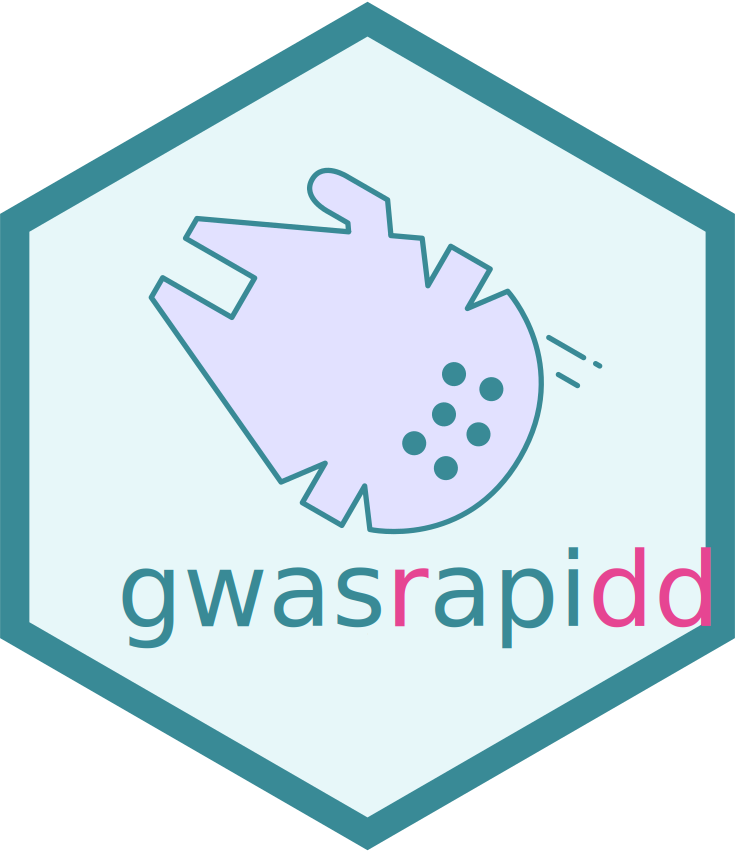

<!-- README.md is generated from README.Rmd. Please edit that file -->

# gwasrapidd <a href="https://rmagno.eu/gwasrapidd/"></a>

[](https://CRAN.R-project.org/package=gwasrapidd)
[](https://doi.org/10.1093/bioinformatics/btz605)
[](https://www.altmetric.com/details/64505748)
[](https://github.com/ramiromagno/gwasrapidd/actions/workflows/R-CMD-check.yaml)
[](https://opensource.org/license/mit)

The goal of `{gwasrapidd}` is to provide programmatic access to the
[NHGRI-EBI Catalog](https://www.ebi.ac.uk/gwas) of published genome-wide
association studies.

Get started by reading the
[documentation](https://rmagno.eu/gwasrapidd/articles/gwasrapidd.html).

## Installation

Install `{gwasrapidd}` from CRAN:

``` r
install.packages("gwasrapidd")
```

## Cheatsheet

<a href="https://github.com/rstudio/cheatsheets/blob/master/gwasrapidd.pdf"></a>

## Example

Get studies related to triple-negative breast cancer:

``` r
library(gwasrapidd)
studies <- get_studies(efo_trait = 'triple-negative breast cancer')
studies@studies[1:4]
## # A tibble: 12 × 4
##    study_id     reported_trait        initial_sample_size replication_sample_s…¹
##    <chr>        <chr>                 <chr>               <chr>                 
##  1 GCST002305   Breast cancer (estro… 1,529 European anc… 2,148 European ancest…
##  2 GCST90029052 15-year breast cance… 5,631 European anc… <NA>                  
##  3 GCST90296722 Breast cancer (estro… 2,860 African or A… <NA>                  
##  4 GCST90446470 Breast cancer subtyp… 16,499 European an… <NA>                  
##  5 GCST90446471 Breast cancer subtyp… 16,499 European an… <NA>                  
##  6 GCST90446472 Breast cancer subtyp… 16,499 European an… <NA>                  
##  7 GCST90446474 Breast cancer subtyp… 16,499 European an… <NA>                  
##  8 GCST010100   Breast cancer (tripl… 18,016 European an… <NA>                  
##  9 GCST90454344 Breast cancer (tripl… ~14,900 European a… <NA>                  
## 10 GCST90551896 Triple-negative brea… 262 Bantu-speaking… <NA>                  
## 11 GCST90551897 Triple-negative brea… 262 Bantu-speaking… <NA>                  
## 12 GCST90551898 Triple-negative brea… 262 Bantu-speaking… <NA>                  
## # ℹ abbreviated name: ¹​replication_sample_size
```

Find associated variants with study GCST002305:

``` r
variants <- get_variants(study_id = 'GCST002305')
variants@variants[c('variant_id', 'functional_class')]
## # A tibble: 5 × 2
##   variant_id functional_class   
##   <chr>      <chr>              
## 1 rs4245739  3_prime_UTR_variant
## 2 rs2363956  missense_variant   
## 3 rs10069690 intron_variant     
## 4 rs3757318  intron_variant     
## 5 rs10771399 intergenic_variant
```

## Citing this work

`{gwasrapidd}` was published in Bioinformatics in 2019:
<https://doi.org/10.1093/bioinformatics/btz605>.

To generate a citation for this publication from within R:

``` r
citation('gwasrapidd')
## To cite gwasrapidd in publications use:
## 
##   Ramiro Magno, Ana-Teresa Maia, gwasrapidd: an R package to query,
##   download and wrangle GWAS Catalog data, Bioinformatics, btz605, 2
##   August 2019, Pages 1-2, https://doi.org/10.1093/bioinformatics/btz605
## 
## A BibTeX entry for LaTeX users is
## 
##   @Article{,
##     title = {gwasrapidd: an R package to query, download and wrangle GWAS Catalog data},
##     author = {Ramiro Magno and Ana-Teresa Maia},
##     journal = {Bioinformatics},
##     year = {2019},
##     pages = {1--2},
##     url = {https://doi.org/10.1093/bioinformatics/btz605},
##   }
```

## Code of Conduct

Please note that the `{gwasrapidd}` project is released with a
[Contributor Code of
Conduct](https://rmagno.eu/gwasrapidd/CODE_OF_CONDUCT.html). By
contributing to this project, you agree to abide by its terms.

## Similar projects

- Bioconductor R package *gwascat* by Vincent J Carey:
  <https://www.bioconductor.org/packages/release/bioc/html/gwascat.html>
- Web application *PhenoScanner V2* by Mihir A. Kamat, James R. Staley,
  and others:
  [doi.org/10.1093/bioinformatics/btz469](https://doi.org/10.1093/bioinformatics/btz469)
- Web application *GWEHS: Genome-Wide Effect sizes and Heritability
  Screener* by Eugenio López-Cortegano and Armando Caballero:
  <http://gwehs.uvigo.es/>

## Acknowledgements

This work would have not been possible without the precious help from
the GWAS Catalog team, particularly [Daniel
Suveges](https://www.ebi.ac.uk/about/people/daniel-suveges).
