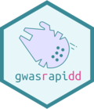

# gwasrapidd 

[](https://travis-ci.org/ramiromagno/gwasrapidd)

The goal of gwasrapidd is to retrieve data from the [NHGRI-EBI Catalog of published genome-wide association studies](https://www.ebi.ac.uk/gwas) via the [REST API](https://www.ebi.ac.uk/gwas/docs/api).


## Installation

Install the development version from GitHub with:

``` r
# install.packages("devtools")
devtools::install_github("ramiromagno/gwasrapidd")
```

## Example

TODO

